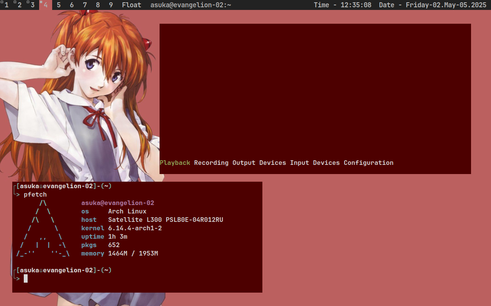
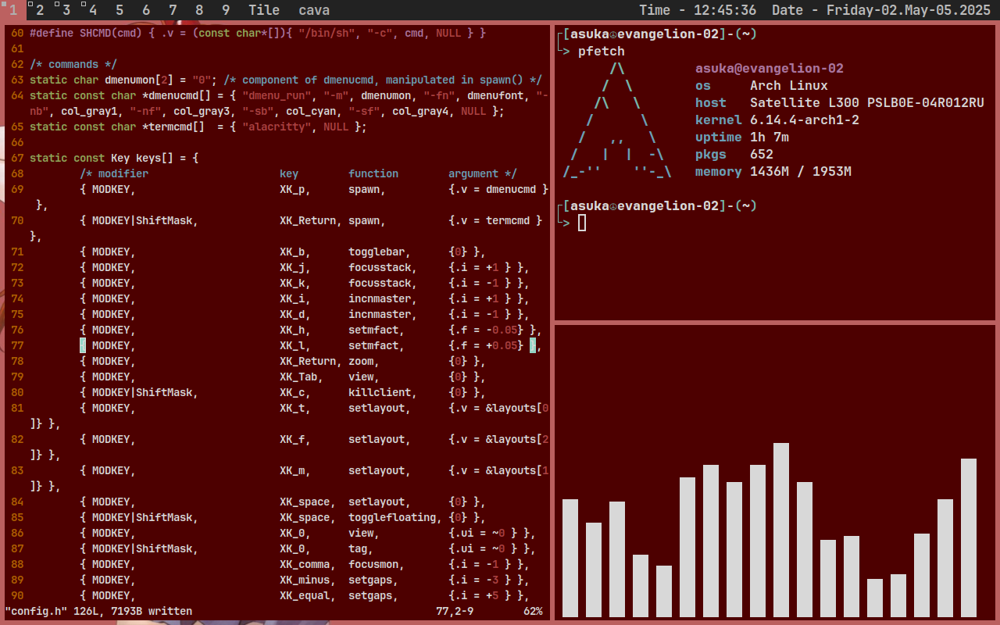

# dwm-asuka

### suckless's dwm asuka theme

## info





you can see:
- dwm
- alacritty
- picom
- flameshot
- pfetch
- cava
- ncpamixer

## install
install with your packet manager needed software:

- alacritty
- picom
- make
- xsetroot
- feh
- dmenu

debian(-based):
```bash
sudo (doas) apt install alacritty picom make xsetroot feh
```
arch(-based):
```bash
sudo (doas) pacman -S alacritty picom make xsetroot feh
```

you also need JetbrainsMono Font


enter to terminal:
```bash
git clone https://github.com/0krohska/dwm-asuka
cd dwm-asuka
sudo (doas) cp -r startdwm.sh date.sh /usr/local/bin/
cd dwm
make
sudo (doas) make install
```

if you use display manager, copy dwm.desktop to /usr/share/xsessions/ 
```bash
cd .. # to "dwm-asuka"
sudo (doas) cp dwm.desktop /usr/share/xsessions/
```

if you use xinit (startx), write to ~/.xinitrc "exec /usr/local/bin/startdwm.sh" 
```bash
echo "exec /usr/local/bin/startdwm.sh" >> ~/.xinitrc
```

copy asuwall.jpg to ~/Pictures/
```bash
mkdir ~/Pictures # if haven't
cp asuwall.jpg ~/Pictures/
```

copy "alacritty" and "picom" folders to ~/.config/
```bash
cp -r alacritty picom ~/.config
```

## login

login with display manager 

#### or

enter in tty

```bash
startx
```
